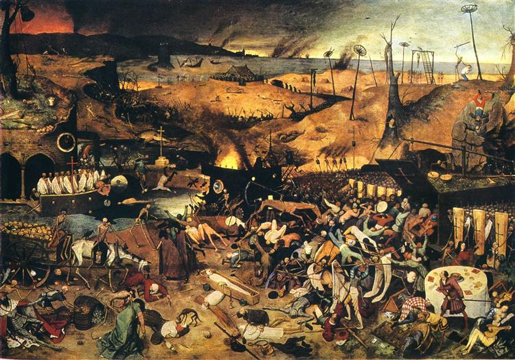
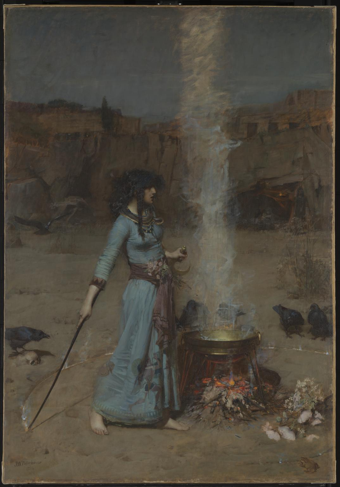
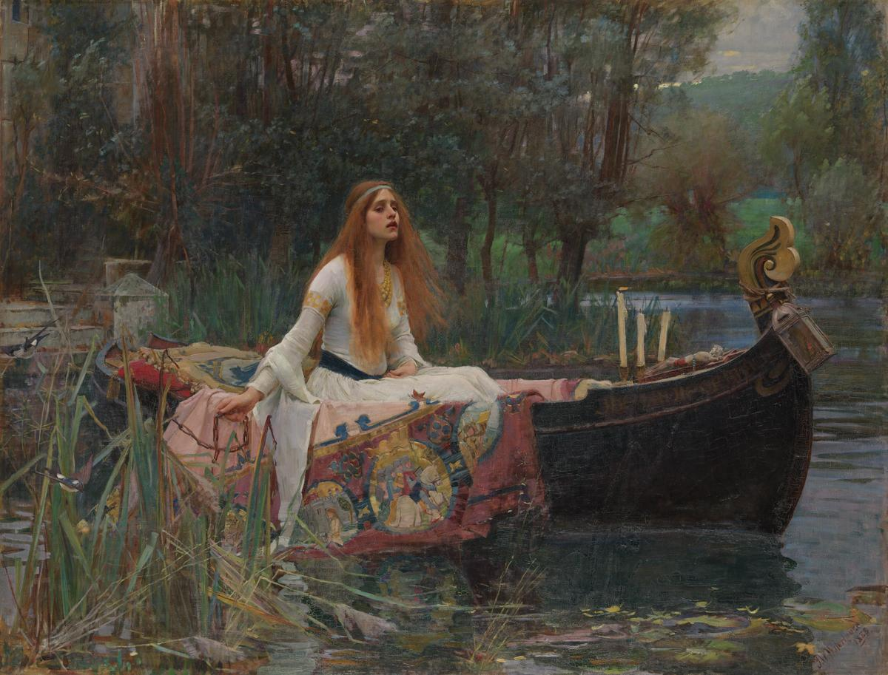

<!-- A 
  

  

    <a class="close" href="#">×</a>
    
    
Bruegel/Bosch? <em>The Triumph of Death</em>

  
 -->

  <a class="close" href="#">×</a>
  
  Bruegel/Bosch? <em>The Triumph of Death</em>

  

  <a class="close" href="#">×</a>
  
   Brueghel <em>Hunters in the Snow</em>

<!-- B 

  
  
  Waterhouse <em>Magic Circle</em>

 

  
  
  Waterhouse <em>The Lady of Shalott</em>

 -->

    
### Microscopy
electron images

immunofluorescence images

xenium in situ images

### Monkeys

### Books

 
 
 

